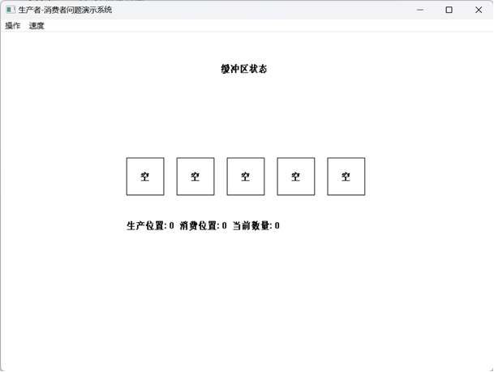
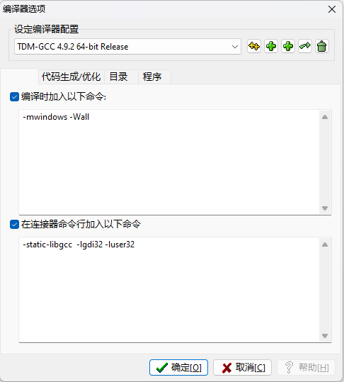

## 项目介绍

- 项目名称：基于C语言的消费者-生产者演示界面

- 项目描述：一个基于 Windows 平台的生产者 - 消费者问题演示系统。通过该系统展示生产者线程生产数据并放入缓冲区，消费者线程从缓冲区取出数据进行消费的过程，同时实现图形化界面，直观地呈现缓冲区状态、提供操作菜单以控制生产者和消费者的启动、暂停、清空缓冲区以及调整生产消费速度等功能，并通过线程同步机制确保缓冲区操作的正确性和程序的稳定性。

- 系统截图：

## 运行环境

- 操作系统：Windows
- 开发工具：Dev-C++ 5.11
- 编程语言：C 

## 注意
- Dev-C++编译器选项设置：

`-mwindows -Wall`  和 `-static-libgcc  -lgdi32 -luser32`

